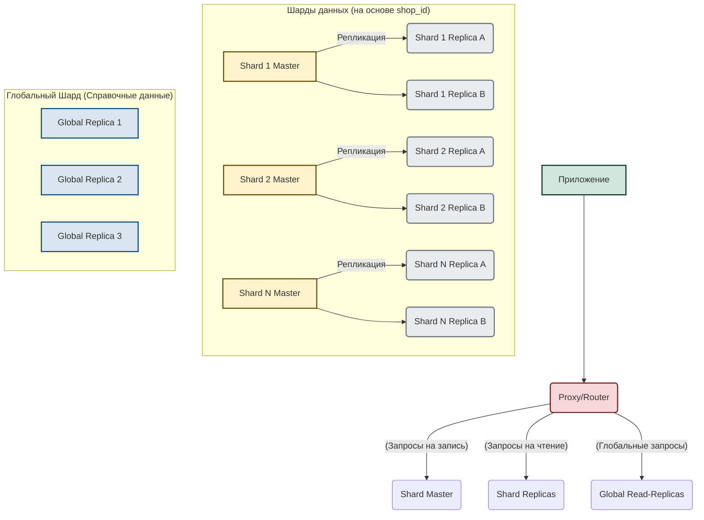

# Домашнее задание к занятию «Репликация и масштабирование. Часть 2» - Савкин И.Н.

## Задание 1. Преимущества разных схем репликации

### 1. Активный Master + пассивный Slave (hot standby) Slave
**Основные преимущества:**
- Высокая доступность записи: при падении Master можно за секунды–минуты переключить приложение на Slave (failover).
- Нулевая или почти нулевая потеря данных при использовании semi-sync replication.
- Slave можно использовать для бэкапов, аналитики и тяжёлых отчётов без нагрузки на основной сервер.
- Простая и быстрая настройка автоматического переключения (MHA, Orchestrator, ProxySQL).

### 2. Один Master + несколько Slave-серверов
**Основные преимущества:**
- Масштабирование чтения: каждый новый Slave увеличивает пропускную способность SELECT-запросов.
- Геораспределение: можно разместить реплики в разных регионах → низкая задержка для пользователей.
- Разделение нагрузки: отдельные Slave под аналитику, поиск, отчёты, бэкапы.
- Лёгкое горизонтальное масштабирование: добавил ещё один Slave — получил +20–50 % производительности на чтение.

## Задание 2. План вертикального и горизонтального масштабирования + шардинг

